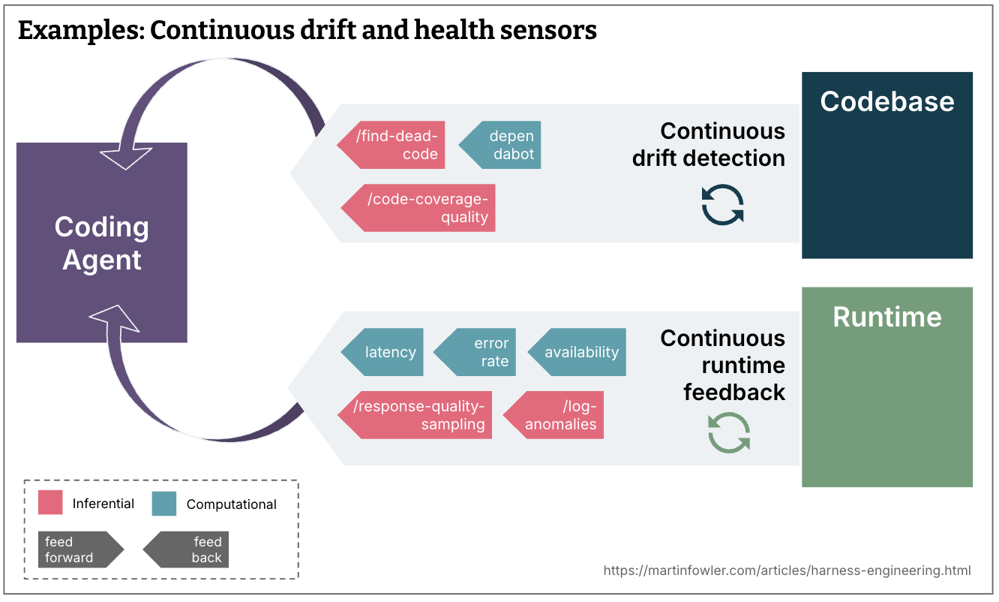

# Chapter 05 — Quality left, CI, and CD

**You'll learn:** how continuous integration and continuous delivery ideas become the timing model for agent feedback, and why the best harness moves cheap checks as early as possible.

Source jumps: Fowler's [Continuous Integration](https://martinfowler.com/articles/continuousIntegration.html), Fowler's [Continuous Delivery](https://martinfowler.com/bliki/ContinuousDelivery.html), Böckeler's [Timing: Keep quality left](https://martinfowler.com/articles/harness-engineering.html#TimingKeepQualityLeft), and Stripe's [shift feedback left](https://stripe.dev/blog/minions-stripes-one-shot-end-to-end-coding-agents).


Image credit: Birgitta Böckeler, [Harness engineering for coding agent users](https://martinfowler.com/articles/harness-engineering.html). Local copy documented in [assets/README.md](../assets/README.md).

## Why old delivery discipline matters more with agents

Harness engineering can sound like a brand-new discipline, but its timing logic is old. Continuous integration says developers integrate frequently and each integration is verified by an automated build including tests. Fowler's [CI article](https://martinfowler.com/articles/continuousIntegration.html) emphasizes detecting integration errors quickly, keeping the build fast, making the build self-testing, fixing broken builds immediately, and making what is happening visible. Continuous delivery says software should be built so it can be released to production at any time, with automated feedback on production readiness.

Coding agents do not make these ideas obsolete. They increase the need for them. If agents can produce changes faster than humans can review, then late feedback becomes expensive chaos. The harness must place checks where they are cheapest and most useful.

Böckeler's phrase is “keep quality left.” In a timeline from idea to production, “left” means earlier. Run cheap, fast checks before commit or before integration. Save expensive, broad checks for later pipeline stages. Run continuous drift and health sensors outside the change lifecycle. This is just CI/CD thinking adapted for agents.

## The agent timeline

A coding-agent change has several moments where feedback can happen:

```text
intent/spec
  │
  ├─ before generation: guides, examples, architecture docs, specs
  │
  ├─ during local work: test, lint, typecheck, browser, logs
  │
  ├─ before PR: self-review, diff review, screenshots, evidence bundle
  │
  ├─ human/agent review: comments, semantic checks, security review
  │
  ├─ integration/CI: full tests, mutation, broader architecture review
  │
  └─ after merge: drift detection, SLOs, dependency scanners, runtime judges
```

Each stage has a different cost profile. A formatter is cheap enough to run constantly. A full browser suite may be slower but still useful before PR. Mutation testing or a broad architecture review may belong in CI. A recurring cleanup agent belongs after integration.

The harness designer's job is to put each sensor at the earliest stage where it gives enough value for its cost.

## Stripe's concrete version

Stripe's minion write-up is unusually clear about timing. A minion run begins in an isolated devbox. The core loop interleaves agent work with deterministic code for git operations, linters, testing, and other required steps. Stripe's first line of defense is a local executable that heuristically selects and runs relevant lints on each git push, usually in less than five seconds. This is feedback left: catch what CI would catch before paying for CI.

If local testing does not catch anything, CI selectively runs from Stripe's enormous test battery. Many test failures have autofixes. If a failure has no autofix, it goes back to the minion. But Stripe caps this loop: at most two CI rounds. They explicitly mention the balancing act between speed and completeness and the diminishing returns of many full CI loops.

This matters because it punctures a fantasy: autonomy does not mean unbounded retries. A good harness is not “loop until green no matter the cost.” It is “run the right local checks, escalate to CI when needed, retry within a budget, then hand off if the cost-benefit curve turns bad.”

## OpenAI's version: local legibility and recurring cleanup

OpenAI's Codex setup also shifts feedback into the agent's local environment. Codex can boot the app per worktree, drive it through the browser, inspect logs and metrics, and validate performance constraints. That makes the app itself legible during the agent run.

OpenAI also adds continuous cleanup: background Codex tasks scan for deviations from “golden principles,” update quality grades, and open targeted refactoring PRs. The team compares this to garbage collection. Technical debt compounds; small continuous cleanup is cheaper than Friday slop cleanup.

This expands “quality left” into “quality continuous.” Some sensors do not belong only in a PR. Dead code detection, coverage quality, dependency drift, documentation rot, and reliability anomalies can run on a cadence and feed new work back into the system.

## CI/CD as a trust-building machine

Continuous integration and delivery were always about trust. Can we merge often without fear? Can we deploy when the business wants? Can we know quickly when the system is broken? Agents add a new trust barrier: AI-generated code is nondeterministic, often plausible, and sometimes wrong in ways that look polished.

A harness builds trust by making correctness evidence cheap and visible. For a human reviewer, a PR from an agent should not just say “done.” It should include:

- What changed.
- Which commands ran.
- Test/lint/typecheck output.
- Browser or screenshot evidence for UI changes.
- Known limitations.
- Any skipped checks and why.
- Links to source specs or issue context.

Simon Willison's agentic engineering patterns repeatedly emphasize evidence. In [linear walkthroughs](https://simonwillison.net/guides/agentic-engineering-patterns/linear-walkthroughs/), he has agents generate detailed explanations with real code snippets rather than hallucinated summaries. In testing patterns, he stresses running tests and using tools to prove behaviour. This is the same trust principle: make the agent show its work.

## Cheap checks versus expensive checks

A useful rule of thumb:

- If a check is deterministic, fast, and local, run it before every commit or agent handoff.
- If a check is deterministic but slower, run it before PR or in CI.
- If a check is inferential and cheap enough, run it as self-review.
- If a check is inferential and expensive, reserve it for risky changes or scheduled audits.
- If a check requires human judgement, make the agent prepare evidence so the human spends attention on judgement, not archaeology.

Examples:

| Check | Timing |
|---|---|
| Formatting | every edit or pre-commit |
| Typecheck | local before PR |
| Unit tests for touched area | local before PR |
| Full test suite | CI |
| Browser smoke path | local for UI changes |
| Visual regression | pre-PR or CI depending cost |
| Mutation testing | CI/nightly/risky changes |
| LLM architecture review | before PR for architecture changes |
| Dependency vulnerability scan | CI and scheduled |
| Dead code scan | scheduled cleanup |

The harness should encode this schedule so agents do not have to guess.

## Feedback messages as teaching material

With humans, a terse failing check can be acceptable because the human knows how to investigate. With agents, the check output is part of the next prompt. That changes how we design errors.

Bad error:

```text
ARCH001 failed
```

Better error:

```text
ARCH001: services may not import UI packages.
Move shared types to packages/types or invert the dependency through a provider interface.
Then rerun: npm run dep-cruiser
```

The second message is both a sensor and a guide. It reports the violation and teaches the correction. OpenAI explicitly writes custom linter messages to inject remediation instructions into agent context. This is one of the highest-leverage small practices in harness engineering.

## Continuous drift and runtime sensors

Böckeler's article distinguishes change-lifecycle feedback from continuous sensors. Some problems accumulate gradually: dead code, weak tests, architecture drift, stale docs, dependency rot. Others appear at runtime: degrading latency, rising error rates, bad response quality, log anomalies. Agents can monitor or be triggered by these sensors, but only if the harness exposes them.



Image credit: Birgitta Böckeler, [Harness engineering for coding agent users](https://martinfowler.com/articles/harness-engineering.html).

A mature harness might create tickets or PRs from these signals. A dependency scanner opens update PRs. A coverage-quality check asks an agent to propose better tests. A log anomaly detector asks an agent to inspect traces and suggest instrumentation improvements. The human still decides priorities, but the harness keeps entropy visible.

## Chapter takeaways

- CI/CD ideas are not replaced by agents; they become the timing model for agent feedback.
- Put cheap deterministic checks as far left as possible.
- Cap expensive loops; autonomy without budgets becomes waste.
- Feedback messages should teach the agent how to fix the issue.
- Some harness sensors should run continuously after merge, not only during PRs.

**Next:** [Chapter 06 — Maintainability, architecture, and behaviour harnesses](06-maintainability-architecture-behaviour.md).
