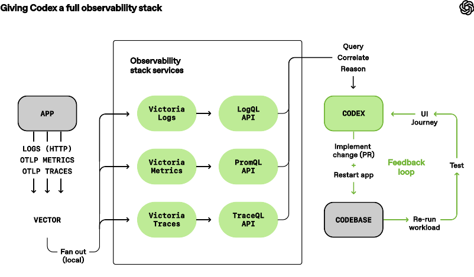

# 02 - Legible Apps And Browsers

OpenAI's most concrete harness move is making the app itself legible to Codex. The [blog](https://openai.com/index/harness-engineering/) says the team made the app bootable per git worktree, wired Chrome DevTools Protocol into the agent runtime, and created skills for DOM snapshots, screenshots, and navigation. It also says logs, metrics, and traces were exposed through an ephemeral local observability stack for each worktree.

That set of choices converts the app from a thing a human looks at into a thing the agent can inspect. Source code alone is not enough. A web app has rendered layout, timing, browser state, network requests, console errors, accessibility tree, logs, traces, startup behavior, and user journeys. If Codex cannot see those surfaces, it has to infer runtime behavior from files. Sometimes that works. For difficult UI and production-quality work, inference is too weak.


The local copy above comes from OpenAI's article and is credited in [assets/README.md](../assets/README.md). The useful lesson is not the exact diagram shape. It is the loop: Codex changes code, boots the app, observes the app, acts through browser controls, records evidence, and repeats until the observed state matches the task.

## ELI5

Imagine a robot chef trying to bake a cake. If the robot can only read the recipe, it may not know that the oven is broken, the batter is too dry, or the cake is burning. If the robot has a camera, thermometer, timer, and smell sensor, it can adjust. Browser and observability tools are the camera, thermometer, and timer for software.

For Codex, a failing Playwright test, a screenshot, a DOM snapshot, a console error, or a trace is more useful than a vague sentence saying "the page looks wrong." Good harnesses give the agent sensors.

## Per-Worktree App Instances

A git worktree is a second checkout of the same repository. OpenAI's blog says they made the app bootable per worktree so Codex could launch and drive one instance per change. Official Codex docs describe worktrees as a way to run multiple independent tasks in the same project without interfering with the local checkout, and note that Codex-managed worktrees live under `$CODEX_HOME/worktrees` with cleanup rules in the [Worktrees](https://developers.openai.com/codex/app/worktrees/) docs.

The per-worktree part matters because agent concurrency changes failure modes. If three agents share one dev server, one database, one cache, and one browser profile, their evidence becomes contaminated. Agent A may validate Agent B's build. A migration may apply to the wrong checkout. A browser tab may show stale assets. The harness needs isolation that is boring enough to trust.

For Linux/macOS replication, start with deterministic per-worktree ports:

```bash
#!/usr/bin/env bash
set -euo pipefail

root="$(git rev-parse --show-toplevel)"
name="${1:?usage: scripts/new-agent-worktree <name> <port>}"
port="${2:?usage: scripts/new-agent-worktree <name> <port>}"

git -C "$root" worktree add "../$(basename "$root")-$name" -b "agent/$name"
cd "../$(basename "$root")-$name"

printf 'PORT=%s\n' "$port" > .env.agent
npm install
PORT="$port" npm run dev
```

That script is not enough for production use, but it establishes the invariant: each agent gets a checkout, port, and runtime identity. The next step is to add a task ID to logs, traces, screenshots, and test output so evidence always points back to a specific worktree.

## Browser/CDP Validation

OpenAI mentions Chrome DevTools Protocol in the article. Official OpenAI Codex app docs now expose a related user-facing pattern through the [in-app browser](https://developers.openai.com/codex/app/browser/): Codex and the user can share rendered pages, browser use can click/type/inspect/take screenshots for local dev servers and file-backed previews, and the page content is treated as untrusted context. The docs also say the in-app browser is not for authenticated flows or existing browser profiles; signed-in work belongs in a regular browser or extension path with additional caution.

Practically, there are two replication paths:

- Use Codex's built-in browser features when your task fits the Codex app.
- Build your own Playwright/CDP harness when you need deterministic evidence in CI or local loops.

The local version can be simple:

```bash
npm install -D @playwright/test
npx playwright install chromium
```

Then write a smoke test:

```ts
import { test, expect } from "@playwright/test";

test("settings page renders without layout overflow", async ({ page }) => {
  await page.goto(process.env.APP_URL ?? "http://127.0.0.1:4301/settings");
  await expect(page.getByRole("heading", { name: "Settings" })).toBeVisible();
  await expect(page).toHaveScreenshot("settings.png", { fullPage: true });
});
```

For an agent harness, the screenshot is not just a regression artifact. It is input to review. The agent can inspect the screenshot, compare it with a previous run, and cite the file in its handoff. If the agent has browser control, it can also reproduce the bug before editing. That matters: "reproduce first" prevents agents from confidently fixing the wrong thing.

## Local Observability

OpenAI's observability diagram is copied locally:



The [blog](https://openai.com/index/harness-engineering/) says logs, metrics, and traces are exposed to Codex via a local observability stack that is ephemeral for each worktree. Agents can query logs with LogQL and metrics with PromQL. The examples in the article are performance prompts such as startup under a time budget or critical journeys with span limits.

The important move is not "use exactly LogQL and PromQL." It is "make runtime signals queryable by the agent." Your first version can be cruder:

```bash
mkdir -p .agent-artifacts/logs
PORT=4301 npm run dev 2>&1 | tee .agent-artifacts/logs/server.log
```

Then add a log query script:

```bash
#!/usr/bin/env bash
set -euo pipefail
pattern="${1:?usage: scripts/log-search <pattern>}"
rg -n "$pattern" .agent-artifacts/logs
```

For traces, start with OpenTelemetry if your stack already supports it. If not, add span-like structured timing around important paths:

```ts
const started = performance.now();
try {
  await loadDashboard();
} finally {
  console.log(JSON.stringify({
    event: "span",
    name: "dashboard.load",
    duration_ms: Math.round(performance.now() - started),
    route: "/dashboard"
  }));
}
```

Now the agent can run:

```bash
scripts/log-search '"name":"dashboard.load"'
```

The first harness does not need a full Grafana stack. It needs stable signals. As maturity increases, use local Prometheus, Loki, Tempo, or OpenTelemetry collectors. The OpenAI lesson is that observability should be task-scoped, queryable, and cleaned up with the worktree.

## Computer Use And Custom UI Harnesses

OpenAI's [Computer use API guide](https://developers.openai.com/api/docs/guides/tools-computer-use) expands the same idea beyond web apps. It says computer use lets a model operate software through screenshots and interface actions, or through custom harnesses that combine visual and programmatic UI interaction. It recommends isolated browsers or VMs, empty environments for browser automation, disabled extensions and local filesystem access where possible, and explicit confirmation policies for risky actions.

This matters because browser/CDP is not the whole story. A serious harness may need:

- Playwright for web flows.
- PyAutoGUI or OS-level automation for desktop flows.
- Simulator control for mobile flows.
- A VM or container for untrusted UI.
- Screenshot evidence at original or stable resolution.
- A stop policy for actions that send data, change access, delete state, accept browser permission prompts, or bypass safety barriers.

For Linux, a cheap local VM path is Docker plus Xvfb for browser UI, or Multipass/UTM for Ubuntu desktops. For macOS, Playwright works well for web, while desktop automation requires Accessibility and Screen Recording permissions. If you use those permissions, scope tasks tightly. The OpenAI Codex [Computer Use app docs](https://developers.openai.com/codex/app/computer-use) similarly warn that computer use can reach outside the workspace and should be used for scoped tasks with permission prompts reviewed.

## Evidence Checklist For UI Tasks

Every UI task should leave evidence. A useful handoff from an agent should include:

- Worktree path and branch.
- App URL and port.
- Exact command used to start the app.
- Reproduction step before the fix.
- Screenshot or video of the failure when applicable.
- Test or browser script used to validate the fix.
- Screenshot or video after the fix.
- Relevant console errors, network failures, logs, metrics, or traces.
- Known limitation, such as "signed-in Chrome flow not validated."

This is the bridge between autonomy and review. Humans do not need to watch every click if the harness produces audit-grade artifacts. But humans still need to decide whether the evidence covers the acceptance criteria.

## Failure Modes

The main failure mode is fake validation. An agent can run a dev server and screenshot a blank page. It can run a browser test against the wrong port. It can validate a route without the relevant state. It can use stale screenshots. The harness should make those mistakes visible.

Use stable labels in artifacts:

```text
.agent-artifacts/
  task-123/
    env.txt
    before/
      screenshot.png
      console.log
      server.log
    after/
      screenshot.png
      console.log
      server.log
    validation.md
```

Make `env.txt` include hostname, worktree path, git SHA, port, browser version, and command. Make `validation.md` list acceptance criteria and the evidence file for each one. This mirrors OpenAI's broader idea: when the agent struggles, do not merely tell it to be better. Give it a clearer sensor, a clearer action, or a clearer rule.

## A Browser Evidence Contract

To make browser evidence hard to fake accidentally, define an artifact contract. The contract should be simple enough for the agent to follow and strict enough for a validator to inspect.

```text
.agent-artifacts/<task-id>/browser/
  before/
    route.txt
    viewport.txt
    screenshot.png
    console.log
    network.json
    notes.md
  after/
    route.txt
    viewport.txt
    screenshot.png
    console.log
    network.json
    notes.md
  validation.md
```

`route.txt` records the exact URL. `viewport.txt` records width, height, device scale factor, browser name, and browser version. `console.log` captures warnings and errors. `network.json` captures failed requests and slow requests. `notes.md` explains what the screenshot is supposed to prove. `validation.md` maps acceptance criteria to artifacts.

A validation note should read like this:

```md
# Browser Validation

Task: settings mobile overflow
Worktree: /home/me/code/myapp-agent-settings-overflow
Git SHA: abc1234
App URL: http://127.0.0.1:4301/settings

Acceptance criteria:

- [x] Save button stays inside footer at 390x844.
  Evidence: `after/screenshot.png`, `after/viewport.txt`.
- [x] No console errors on initial render.
  Evidence: `after/console.log`.
- [x] Failed network requests are unchanged from before state.
  Evidence: `before/network.json`, `after/network.json`.
```

This is boring by design. It gives Codex a checklist. It gives a human reviewer a fast audit path. It gives a future cleanup agent a stable artifact shape to inspect.

## CDP Skills Versus Playwright Tests

OpenAI's article mentions CDP skills. Playwright is not the same thing, but it is a practical replication path because Playwright sits on top of browser automation and can collect screenshots, DOM state, traces, console logs, and network events. A CDP skill is usually more flexible inside an agent runtime; a Playwright test is more deterministic inside CI. Mature harnesses often use both.

Use CDP/browser skills when the agent needs exploratory inspection, the target state is not yet known, the agent needs to click around and form a hypothesis, or the evidence is part of an interactive debugging session. Use Playwright tests when the expected behavior is known, CI must fail on recurrence, or you need a stable artifact format.

One useful pattern is "explore with browser use, codify with Playwright." Let Codex reproduce a bug through the browser. Then require Codex to write a regression test that fails before the fix and passes after. The browser evidence proves the immediate task; the test prevents recurrence.

## Observability Queries As Acceptance Criteria

OpenAI's examples include prompts like startup under a time budget or spans under a threshold. That turns metrics into acceptance criteria. Instead of saying "make startup faster," say:

```text
Acceptance: `service.startup.duration_ms` p95 is under 800ms in the local worktree run.
Evidence: attach the metric query output and the trace for the slowest startup path.
```

If you do not have Prometheus yet, write a local query script:

```bash
#!/usr/bin/env bash
set -euo pipefail
task="${1:?task id}"
jq -r 'select(.event == "metric" and .name == "service.startup.duration_ms") | .value' \
  ".agent-artifacts/$task/logs/metrics.jsonl" |
  sort -n |
  tail -1
```

Now the agent can run `scripts/metric-max "$TASK_ID"` and put the output in `validation.md`. The point is not statistical perfection. The point is to make performance claims inspectable.

## Signed-In Browser Flows

The OpenAI in-app browser docs say the in-app browser is not for authenticated flows, regular browser profiles, cookies, extensions, or existing tabs. That limitation is important for replication. Many serious products need login state. You have three options: create test-only seeded users and authenticate through Playwright in an isolated browser context, use a local auth bypass only in development with guards, or use a human-controlled browser or Codex Chrome/Computer Use path with explicit permission boundaries.

Avoid letting an agent freely use your personal browser profile for broad tasks. If the agent can click through signed-in pages, it may be able to send messages, change settings, expose private data, or accept prompts. The [computer use guide](https://developers.openai.com/api/docs/guides/tools-computer-use) recommends treating page content and screenshots as untrusted input and pausing for risky external actions. That warning applies directly to signed-in browser harnesses.

## The Payoff

Once app and browser evidence are reliable, tasks change shape. A bug report can say "reproduce route X at viewport Y and attach before/after evidence." A performance task can say "prove span Z stays below threshold." A visual polish task can say "compare screenshot A and B and keep card height stable." These are high-quality prompts because they are tied to sensors.

That is the deeper OpenAI lesson: a capable model is not enough. The harness must give the model eyes, gauges, and a way to leave proof.
