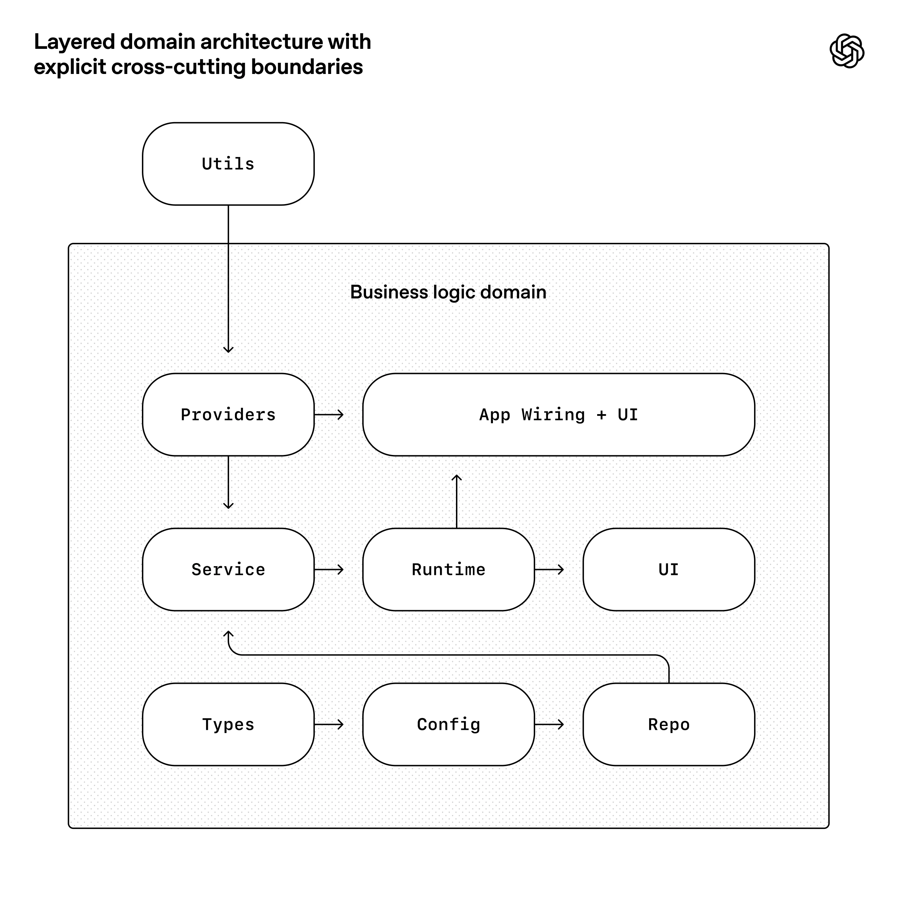

# 04 - Invariants And Lints

OpenAI's harness story becomes serious when it moves from documentation to enforcement. The [blog](https://openai.com/index/harness-engineering/) says documentation alone does not keep a fully agent-generated codebase coherent. The team built around a rigid architectural model: fixed layers inside each business domain, validated dependency directions, limited permissible edges, and cross-cutting concerns entering through a Providers boundary. Custom linters and structural tests enforce these rules.

The local OpenAI architecture diagram captures this:



The diagram's durable lesson is that speed without boundaries is decay. When agents can produce many PRs, architectural drift compounds faster than humans can review it manually. A harness must define which choices are free and which are not.

## ELI5

Imagine a city where everyone can build roads wherever they want. At first, construction is fast. Soon roads cross randomly, emergency vehicles cannot pass, and nobody knows where anything goes. A city planner does not design every house, but they do enforce streets, zones, and safety codes.

In an agent-generated codebase, architecture invariants are the city plan. Custom lints are the building inspectors. They do not decide every implementation detail. They stop the system from becoming impossible to navigate.

## Invariants, Not Micromanagement

The OpenAI article gives an important example: require Codex to parse data shapes at boundaries, but do not prescribe the exact library. That is the right abstraction level. The invariant is "untrusted external shapes must be parsed at the boundary." The implementation can be Zod, io-ts, Pydantic, serde, or another local pattern.

For a practitioner, write invariants at three levels:

1. Architectural invariants: dependency direction, package boundaries, layer ownership, allowed imports.
2. Reliability invariants: structured logging, boundary parsing, retries, idempotency, startup time, test coverage around critical paths.
3. Taste invariants: file size, naming conventions, schema names, hook location, component density, error-message style.

Taste matters because agents copy patterns. If the repo contains ten slightly different helpers, Codex may create an eleventh. If the repo has a clear shared utility package and a lint that rejects local duplicates, the agent is pushed toward reuse.

## Turning A Rule Into A Check

Suppose you want a TypeScript service domain to follow:

```text
types -> config -> repo -> service -> runtime -> ui
```

and you want `ui` not to import `repo` directly. Write a check:

```js
const fs = require("fs");
const path = require("path");

const order = ["types", "config", "repo", "service", "runtime", "ui"];
const root = "src/domains";

function layerOf(file) {
  const parts = file.split(path.sep);
  const i = parts.indexOf("domains");
  return i >= 0 ? parts[i + 2] : null;
}

function allowed(from, to) {
  if (!from || !to || from === to) return true;
  return order.indexOf(to) <= order.indexOf(from);
}
```

That sketch is incomplete, but it shows the shape. The check finds imports, maps files to layers, and fails if a dependency points the wrong direction. The failure message should not only say "bad import." It should teach the agent:

```text
ui must not import repo directly.
Move data access into service, then call service from ui.
See docs/ARCHITECTURE.md#domain-layers.
```

This is one of the highest-leverage harness tricks: error messages are prompts. If the agent sees a precise remediation path in a failing lint, it can fix itself without a human review comment.

## Structural Tests

Linters catch static shape. Structural tests catch behavior and generated state. Examples:

- Every route has an owner and auth policy.
- Every external API response has a parser.
- Every event emitted to analytics has a schema.
- Every domain has `types`, `repo`, `service`, and `runtime` tests.
- No production package imports from a test helper path.
- No UI component imports server-only modules.
- No file exceeds a size threshold without an explicit exception.

Use tests when a rule needs richer local context:

```ts
test("all API routes declare auth", async () => {
  const routes = await loadRouteManifest();
  for (const route of routes) {
    expect(route.auth, `${route.path} missing auth policy`).toBeDefined();
  }
});
```

Again, the message matters. It should name the missing artifact and where to add it.

## Architecture Docs As Lint Inputs

A mature harness should avoid duplicating architecture in prose and code. If `docs/ARCHITECTURE.md` says the layers are `types`, `config`, `repo`, `service`, `runtime`, `ui`, the lint should either read a machine-readable sidecar or the docs should link to the config used by the lint.

Example:

```yaml
# architecture.yaml
domains_root: src/domains
layers:
  - types
  - config
  - repo
  - service
  - runtime
  - ui
providers:
  - src/providers
```

Then docs describe the rule and scripts enforce it:

```bash
node scripts/check-architecture.js architecture.yaml
```

Now an agent changing the architecture has to update both the explanation and the enforcement source. CI catches drift.

## Custom Lints As Taste Carriers

OpenAI's blog says custom lints statically enforce structured logging, naming conventions, schema/type names, file-size limits, and platform-specific reliability requirements. These are not glamorous, but they are exactly where agent output can drift.

A logging lint might require structured JSON logs:

```text
Forbidden: console.log("started", id)
Allowed: logger.info("job_started", { job_id: id })
```

A schema naming lint might require:

```text
UserInputSchema
UserOutputSchema
UserRecordSchema
```

instead of local variations. A file-size lint might fail at 400 lines and point to `docs/ARCHITECTURE.md#module-size`. A platform lint might require macOS app tests to check accessibility permissions or Windows tests to avoid POSIX-only path assumptions.

The goal is not to satisfy a human's aesthetic preference. The goal is to make future agent runs more predictable. Every time a lint collapses ten possible local patterns into one approved pattern, it reduces search space.

## Boundary Parsing

Boundary parsing deserves special emphasis. Agents are prone to building on guessed shapes because they can infer plausible JSON from nearby code. That is dangerous. The OpenAI article says they require parsing data shapes at the boundary.

A TypeScript example:

```ts
import { z } from "zod";

const CustomerResponse = z.object({
  id: z.string(),
  plan: z.enum(["free", "pro", "enterprise"]),
  created_at: z.string()
});

export async function fetchCustomer(id: string) {
  const response = await fetch(`/api/customers/${id}`);
  const json = await response.json();
  return CustomerResponse.parse(json);
}
```

A Python example:

```py
from pydantic import BaseModel

class CustomerResponse(BaseModel):
    id: str
    plan: str
    created_at: str
```

The harness check is not "use Zod." The harness check is "all external data crosses a parser before domain logic sees it."

## Linux/macOS Replication Steps

Start with one invariant and one check:

```bash
mkdir -p scripts docs
touch docs/ARCHITECTURE.md architecture.yaml scripts/check-architecture.js
```

Write the rule in English in `docs/ARCHITECTURE.md`. Write the same rule in `architecture.yaml`. Implement the smallest check that fails on a real violation. Add it to `make validate`:

```make
validate:
	node scripts/check-architecture.js architecture.yaml
	npm test
```

Now ask Codex to intentionally add a bad import in a scratch branch, run validation, and fix it. If Codex cannot fix it from the error message, improve the error message. That loop is harness engineering. The lint is not done when it catches humans. It is done when it teaches agents to repair the violation.

## When To Avoid New Rules

Rules have carrying cost. Do not add a custom lint for a one-off annoyance. Add a rule when:

- The mistake repeats.
- The mistake is costly to review manually.
- The fix pattern is clear.
- The check can produce a precise remediation message.
- The rule supports agent legibility or safety.

Also avoid rules that encode unstable taste. If a senior engineer cannot explain why the rule protects correctness, velocity, legibility, or safety, it may be noise. Agents already have enough instructions. Good harness rules reduce ambiguity; bad rules increase it.

## The Control-System View

Architecture docs define the desired state. Lints detect deviation. Error messages tell the agent how to return. CI prevents drift from merging. Cleanup agents scan for older deviations. Review agents catch gaps the lints miss. Human reviewers decide whether the invariant itself still makes sense.

That is a control system. OpenAI's lesson is that once agent throughput rises, control systems matter earlier than they would in a human-only codebase. The constraints are not a late-stage platform luxury. They are the thing that lets speed avoid turning into decay.

## The Invariant Ladder

A useful way to design checks is to climb an invariant ladder. Each rung is stronger than the previous one:

1. A prompt asks the agent to do the right thing.
2. A doc explains the right thing.
3. A review checklist asks whether the right thing happened.
4. A lint detects obvious violations.
5. A structural test detects deeper violations.
6. A generator makes the bad state hard to create.
7. A type or schema makes the bad state impossible to represent.

Do not jump to the strongest rung every time. Climb when mistakes repeat. If agents repeatedly forget a product-copy rule, a checklist may be enough. If agents repeatedly build unsafe data access, use a parser, type, or code generator.

Example: external API responses. The weak version is a prompt saying "validate API responses." The stronger version is a lint that rejects `await response.json()` outside a boundary package. The strongest version is a generated client that only returns parsed branded types. The higher rungs reduce reliance on agent memory.

## Writing Agent-Repairable Errors

Many lints are written for humans who already understand the rule. Agent-oriented lints should be more explicit. They should include what failed, why it matters, where the rule is documented, the smallest likely repair, and an example of allowed shape.

Bad:

```text
Invalid import.
```

Better:

```text
Architecture violation in src/domains/billing/ui/InvoicePanel.tsx:
UI code imported src/domains/billing/repo/invoices.ts directly.

Rule: UI may call service, service may call repo. UI may not call repo.
Why: repo access bypasses domain orchestration and makes future agent changes harder to reason about.
Repair: move the data call into src/domains/billing/service/ and import that service from UI.
Docs: docs/ARCHITECTURE.md#domain-layers.
```

This is longer, but it saves review cycles. The agent can act on it immediately. Human reviewers also benefit.

## Exceptions And Drift

Rigid rules need explicit exception handling. Otherwise agents will either get blocked on legitimate edge cases or create hacks to satisfy the lint.

```yaml
architecture_exceptions:
  - file: src/domains/billing/ui/LegacyInvoicePanel.tsx
    rule: no-ui-to-repo
    reason: legacy migration; remove after invoice service extraction
    owner: billing
    expires: 2026-07-01
```

Then make the lint enforce expiration. This turns exceptions into managed debt. A cleanup agent can scan expired exceptions and open targeted PRs.

Track invariant violations over time:

```text
date,rule,violations
2026-06-01,no-ui-to-repo,12
2026-06-08,no-ui-to-repo,7
2026-06-15,no-ui-to-repo,2
```

If violations rise, the rule may be unclear, the error message may be weak, or the architecture may not fit the work. A good harness does not assume every violation means the agent is careless. Sometimes violations reveal bad architecture.

## Taste As A Shared Interface

Taste invariants are easy to dismiss, but the OpenAI article includes them for a reason. Agents learn from local examples. If the repo tolerates inconsistent names, oversized files, ad hoc logging, and one-off helpers, agents will reproduce that inconsistency. Taste rules are not about personal preference when they protect navigation.

Good taste invariants include component size limits, shared helper locations, consistent error class names, schema suffixes, stable log event names, and a single layer for user-facing copy. Bad taste invariants depend on one person's preference, have many subjective exceptions, fail without repair paths, or block experiments without protecting future legibility.

The agent-first question is: will this rule make the next agent run easier to reason about?
